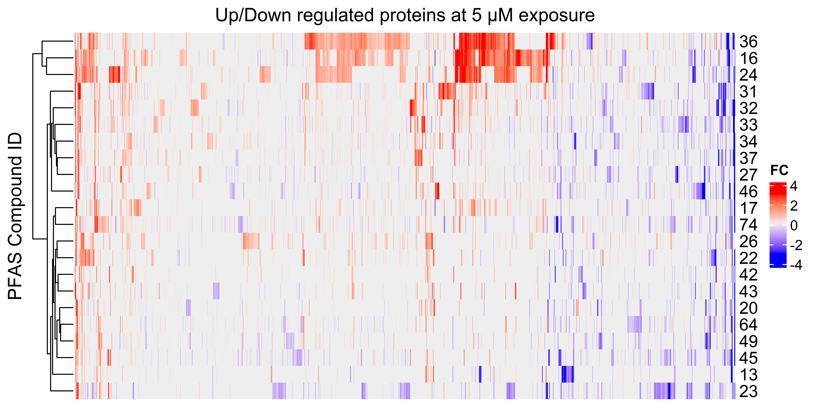

count: false

```{r setup, include=FALSE}
knitr::opts_chunk$set(echo = FALSE, message = FALSE, warning = FALSE, error = FALSE)
```

<!-- 
  colours: 
    oxford blue #0A214F
    White #FFFFFF
    Portland Orange #F46036
    Titatium Yellow #F0E100
    Persian Green #1B998B
-->
 
*this slide intentionally kept blank*

---
count: false
background-image: url(images/zebrafish-title.jpg)
background-position: center
background-size: cover
.inverse-title[

## ToxicoProteomics Atlas of Per- and Polyfluoroalkyl Substances 
### **David Hall**, Jiajun Han, Wen Gu, Diwen Yang, and Hui Peng. 
#### Dept. of Chemistry and School of the Environment<br/>University of Toronto
]

.inverse-bottomright[
S. Wilson</br>Welcome Collection

]

???

- Confocal micrograph of zebrafish brain
- Green = GFP in neurons
- Red = axons & neurofils
- Blue = synaptic vesicles 

---

background-image: url(images/74PFAS.png)
background-position: center
background-size: cover

## Much ado about PFAS

???

- 74 Compounds in USEPA's initial PFAS screening library 
- Mixture of Legacy and novel PFAS
- Varying chain length's
- varying head groups 
- **Enough of both to make comparisons...**
- How to do toxicogy testing given number of compounds? 
- image source: https://wellcomecollection.org/works/pftqz7hc
---


background-image: url(images/zebrafish_embryo.jpg)
background-position: center
background-size: cover

.inverse-bottomleft[Annia Cavanagh, Wellcome Collection ] 

???

- *Point out*: 
  - *EYES*
  - *Mouth* 
  - *Pericardial Edema*: fluid build-up around heart
  - *Spinal curvature*: tail supposed to detach from yoke-salk, and straighten out. 
  - *Tail Dysplasia*: malformations of tail fins.  
- *Embryo's are transparent*
- False-coloured SEM of a zebrafish embryo.
- tropical freshwater fish originating from eastern Asia and is a member of the minnow family. 
- embryo as a disease model, an assay system for drug screening and is used in cancer research. 
- Suitable for biomedical rersearch: embryos develop quickly 
  - single cell in a fertilized egg to tiny fish in 24 hours 
  - vertebrates 
  

---

## OECD has adopted Fish Embryo Toxicity testing for acute fish toxicity measurements as it's logistically simpler and more reproducible 

```{r, out.width = "900px", fig.align = "center"}
 

```

.bottomright[
OECD </br> 2022
]

???

- Fish embryos until the onset of independent feeding are considered as nonprotected life stages
- Easy to maintain in lab
- beter interlab reproducibility 
- 


---

## Traditional fish embryo toxicity endpoints are poor predictors of </br>weak acute and sublethal toxicities


```{r, out.width = "1000px", fig.align = "center"}

 

```


???

- *20 embryos per exposure, 3 exposure replicates*
- **16**: N-Methylperfluorooctanesulfonamide
- **24**: N-Ethylperfluorooctanesulfonamide
- **34**: Perfluoro-3,6,9-trioxatridecanoic acid
- **36**: Methyl perfluorohexanoate
- **46**: Perfluorooctanesulfonic acid
- **60**: Perfluorooctanesulfonamide
- **74**: Perfluorooctanoic acid
- Single point testing is slow, and like finding a needle in a hay stack 
- Need a deeper picture to understand what's going
- Since proteins are movers and shakers, why not look at them. 

---

## Proteomics can measure tens of thousands of peptides to relatively quantity thousands of proteins

```{r, out.width = "1000px", fig.align = "center"}
knitr::include_graphics(path = "images/proteomics.png")
```


???

proteomics 

---
## Low- and high-conc PFAS exposures were performed in triplicate; labelling accounts for batch and matrix effects


```{r, out.width = "1000px", fig.align = "center"}
knitr::include_graphics(path = "images/samplePrep.png")
```


---
## Data Independent Acquisition(DIA) captures much more sample information compared to traditional Data-Dependant Acquisition (DDA)

```{r, out.width = "800px", fig.align = "center"}
knitr::include_graphics(path = "images/ludwig_etal.png")
```

.bottomright[
Ludwig et al.,</br> <i>Mol. Syst. Biol.</i> (2018) </br>
Cox et al., </br><i>Nat. Biotechnol.</i> (2008) </br>
Demichev et al., </br><i>Nat Methods</i> (2020)
]


---


.pull-left[

## **Recap**

### - Exposing Zebrafish to 74 PFAS


### - Relative Quantifying proteins </br> through isotopic channels


### - Using latest DIA Software
]
--

.pull-right[

```{r, out.width = "400px", fig.align = "center"}

knitr::include_graphics(path = "images/31.png")

```
PFAS 31: Heptafluorobutyramide

]

---
## DIA aquisition + DIA-NN software identifies more protein-groups per channel and per run then DDA + MaxQuant

.pull-left[

```{r, out.width = "500px", fig.align = "center"}

 

```

]

--

.pull-right[

```{r, out.width = "500px", fig.align = "center"}

knitr::include_graphics("images/DIAvsMQ.png") 

```

]

---
## While DDA matches better within the same run, DIA-NN (plexDIA) performs better across runs

```{r, out.width = "1000px", fig.align = "center"}

 

```


---

## Compound 16 insights

- volcano plots of high and low exposure (linked proteins)

---
## Network pathway enrichment of compound 16

---
## Heat map of total protein up and down regulation 

```{r, out.width = "1000px", fig.align = "center"}

 

```


- clustering 
- elaborate on expanding scope to 74 pfas

---
## PFAS class effects (try and link to Tox Data)


---
## Conclusions & Future Directions

---
## Ackwnowledgements

.pull-left[


- Jiajun Han
- Wen Gu
- Diwen (Rachel) Yang
- Jiabo Liu
- Henry Krause
- US EPA

]

---
## Questions slide
  
---
## 8:2 FTAC & FSPE scheme

---
## 8:2 FTAC results 
