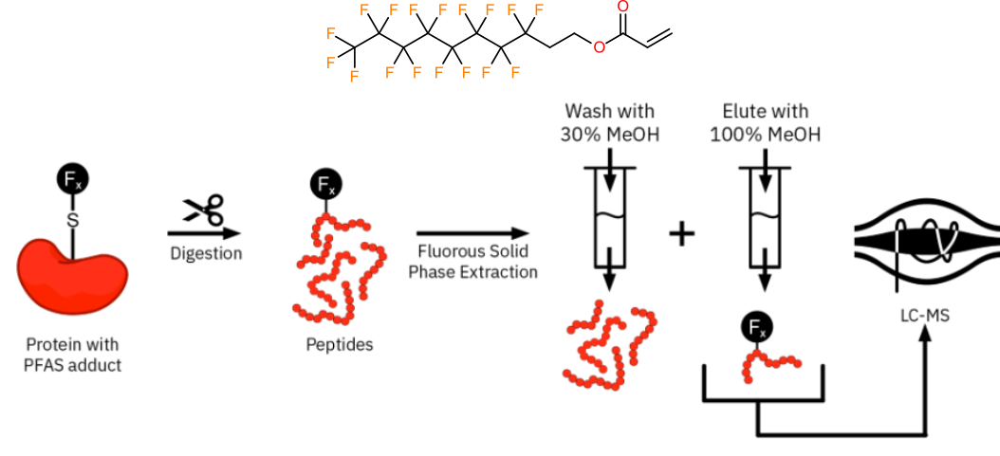
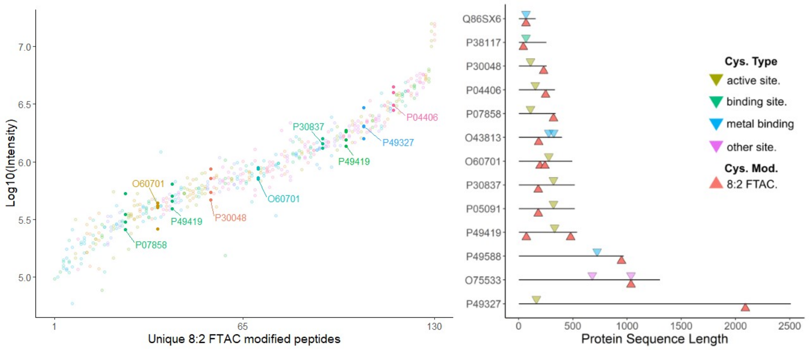

count: false

```{r setup, include=FALSE}
knitr::opts_chunk$set(echo = FALSE, message = FALSE, warning = FALSE, error = FALSE)
```

<!-- 
  colours: 
    oxford blue #0A214F
    White #FFFFFF
    Portland Orange #F46036
    Titatium Yellow #F0E100
    Persian Green #1B998B
-->
 
*this slide intentionally left blank*

---
count: false
background-image: url(images/zebrafish-title.jpg)
background-position: center
background-size: cover
.inverse-title[

## ToxicoProteomics Atlas of Per- and Polyfluoroalkyl Substances 
### **David Hall**, Jiajun Han, Wen Gu, Diwen Yang, and Hui Peng. 
#### Dept. of Chemistry and School of the Environment<br/>University of Toronto
]

.inverse-bottomright[
S. Wilson</br>Welcome Collection

]

???

- Confocal micrograph of zebrafish brain
- Green = GFP in neurons
- Red = axons & neurofils
- Blue = synaptic vesicles 

---

background-image: url(images/74PFAS.png)
background-position: center
background-size: cover

## Much ado about PFAS

???

- 74 Compounds in USEPA's initial PFAS screening library 
- Mixture of Legacy and novel PFAS
- Varying chain length's
- varying head groups 
- **Enough of both to make comparisons...**
- How to do toxicogy testing given number of compounds? 
- image source: https://wellcomecollection.org/works/pftqz7hc
---


background-image: url(images/zebrafish_embryo.jpg)
background-position: center
background-size: cover

.inverse-bottomleft[Annia Cavanagh, Wellcome Collection ] 

???


- *Point out*: 
  - *EYES*
  - *Mouth* 
  - **Pericardium**, little sac (big sac is hatching gland) 
  
- Tox testing
  - *Embryo's are transparent*
  - vertebrates 
  - *Pericardial Edema*: fluid build-up around heart
  - *Spinal curvature*: tail supposed to detach from yoke-salk, and straighten out. 
  - *Tail Dysplasia*: malformations of tail fins.  
- False-coloured SEM of a zebrafish embryo.
- tropical freshwater fish originating from eastern Asia and is a member of the minnow family. 
- embryo as a disease model, an assay system for drug screening and is used in cancer research. 
- Suitable for biomedical rersearch: embryos develop quickly 
  - single cell in a fertilized egg to tiny fish in 24 hours 
  - vertebrates 
  

---

## OECD has adopted Fish Embryo Toxicity testing for acute fish toxicity measurements as it's logistically simpler and more reproducible 

```{r, out.width = "900px", fig.align = "center"}
knitr::include_graphics("images/OECD_testing.png") 

```

.bottomright[
OECD </br> 2022
]

???

- Fish embryos until the onset of independent feeding are considered as nonprotected life stages
- Easy to maintain in lab
- better interlab reproducibility 
- 


---

## Traditional fish embryo toxicity endpoints are poor predictors of </br>weak acute and sublethal toxicities


```{r, out.width = "1000px", fig.align = "center"}

knitr::include_graphics("images/ehpDat.png") 

```


???

- *20 embryos per exposure, 3 exposure replicates*
- **16**: N-Methylperfluorooctanesulfonamide
- **24**: N-Ethylperfluorooctanesulfonamide
- **34**: Perfluoro-3,6,9-trioxatridecanoic acid
- **36**: Methyl perfluorohexanoate
- **46**: Perfluorooctanesulfonic acid
- **60**: Perfluorooctanesulfonamide
- **74**: Perfluorooctanoic acid
- Single point testing is slow, and like finding a needle in a hay stack 
- Need a deeper picture to understand what's going
- Since proteins are movers and shakers, why not look at them. 

---

## Proteomics can measure tens of thousands of peptides to relatively quantity thousands of proteins

```{r, out.width = "1000px", fig.align = "center"}
knitr::include_graphics(path = "images/proteomics.png")
```


???

- Matching peptide sequences to in silico predicted fragments to identify peptides.  

---
## Low- and high-conc PFAS exposures were performed in triplicate; labelling accounts for batch and matrix effects


```{r, out.width = "1000px", fig.align = "center"}
knitr::include_graphics(path = "images/samplePrep.png")
```

???

- Low- and High- level exposures to better evaluate sub-lethal exposure effects 
- Dimethyl labelling enables relative quant and accounting for matrix effects. 

---
## Data Independent Acquisition(DIA) captures much more sample information compared to traditional Data-Dependant Acquisition (DDA)

```{r, out.width = "800px", fig.align = "center"}
knitr::include_graphics(path = "images/ludwig_etal.png")
```

.bottomright[
Ludwig et al.,</br> <i>Mol. Syst. Biol.</i> (2018) </br>
Cox et al., </br><i>Nat. Biotechnol.</i> (2008) </br>
Demichev et al., </br><i>Nat Methods</i> (2020)
]

???

- **DDA**
  - One peptide sequenced / MS2 event
  - **Stochastic peak picking**, poor reproducibility. 
  - Finite amount of MS2 scan events, upper bound on DDA coverage 
  - straightforward peptide sequencing
  - Use **MaxQuant** as benchmark software
- **DIA**
  - multiple peptides / MS2 event
  - greater coverage 
  - More complex data + Spectral Library = greater software demands. 
  - **DIA-NN** uses neural networks for and interference for deep, robust, and reliable, proteome coverage 

---

.pull-left[

## **Recap**

### 1 -  Exposing zebrafish embryos to 74 PFAS


### 2 - Relatively quantify proteins </br> through isotopic channels


### 3 - Latest DIA Software
]

???

- Onwards to how our data actuallly looks
- Begining with a comparison between the two software. 

---

## Randomly selected PFAS 31 exposure samples to assess DIA vs. DDA proteomics analysis


```{r, out.width = "300px", fig.align = "center"}

knitr::include_graphics(path = "images/31.png")

```
PFAS 31: Heptafluorobutyramide


---
## DIA aquisition + DIA-NN software identifies more protein-groups per channel and per run compared to DDA + MaxQuant

.pull-left[

```{r, out.width = "500px", fig.align = "center"}

knitr::include_graphics("images/proteinBars.png") 

```

]

--

.pull-right[

```{r, out.width = "500px", fig.align = "center"}

 

```

]

???

- UpsetPlot, similar to venn diagram but shows all intersections
- Lower number of proteins in these because only confidently ID proteins (one protein per group)
- 

---
## While DDA matches better within the same run, DIA-NN (plexDIA) performs better across runs

```{r, out.width = "1000px", fig.align = "center"}

knitr::include_graphics("images/jaccard_touchedup.png") 

```

???

- Jaccard index shows the overlap between batches
- MQ better within the same run, by definition on how it works, but recall much less hits
- lack of overlap between runs will severely hamper downstream analysis b/c of stats 

---

## Long-chain perfluorinated PFAS 16 was one of the most bioaccumulative and the second most toxic tested PFAS

.pull-left[

```{r, out.width = "300px", fig.align = "center"}

knitr::include_graphics(path = "images/16.png")

```
PFAS 16: N-Methylperfluoro</br>octanesulfonamide

]

.pull-right[

```{r, out.width = "400px", fig.align = "center"}

knitr::include_graphics(path = "images/ehs_mortality.png")

```

.bottomright[
Han et al.,</br> <i>EHP</i> (2021) 
]
]

???

- 2nd most toxic 
- Somewhat bio-accumulative 

---


## PFAS 16 significantly perturbes zebrafish embryo proteome,</br> with > 300 up- and > 100 down-regulated proteins

.pull-left[

```{r, out.width = "400px", fig.align = "center"}

knitr::include_graphics(path = "images/ehs_mortality.png")

```

.bottomleft[
Han et al.,</br> <i>EHP</i> (2021) 
]
]


.pull-right[

```{r, out.width = "400px", fig.align = "center"}

knitr::include_graphics(path = "images/pfas16_volcano.png")

```


]

---

## Which zebrafish embryo proteins perturbed by PFAS 16 exposure potentially reveals mechanisms of toxicity

.pull-left[

```{r, out.width = "400px", fig.align = "center"}

knitr::include_graphics(path = "images/pfas16_volcano.png")

```


]


.pull-right[

```{r, out.width = "400px", fig.align = "center"}

knitr::include_graphics(path = "images/pfas16_gobp_plot.png")

```

]

???

- Only upregulated proteins for PFAS 16 
- makese sense given chemical insult 
- H2O2 and Eye Lense Development, possible oxidative stress and poor eye development
- These are two testable endpoints. 

---

background-image: url(images/analyzed_pfas.png)
background-position: center
background-size: cover

## Analyzed 22 PFAS exposures to date

???

- Blue boxes are compounds analyzed
- All samples are prepapred though, just waiting on instrument run-time. 

---
## Initial survey of global zebrafish embryo proteome perturbation begins to reveal trends

```{r, out.width = "1000px", fig.align = "center"}

knitr::include_graphics("images/mayHeatmap.png") 

```

???

- clustering 
- elaborate on expanding scope to 74 pfas
- Interesting that 13 has a small batch of v. down regulated proteins, interesting because compound 13 is a small triflate.


---
## Conclusions & Future Directions


.pull-left[

Thank you: 

**Conclusions**

- DIA aqusition & DIA-NN enable a more complete survey of the zebrafish proteome. 
- PFAS exhibit structure specific proteome response in zebrafish embryo 

**Future Work**

- Finish zebrafish proteome analysis
- Chemometrics analysis of proteome response
- Verification experiments 


]

.pull-right[

```{r, out.width = "400px", fig.align = "center"}

knitr::include_graphics(path = "images/sig_barplot.png")

```


]

---
## Ackwnowledgements

.pull-left[

Thank you: 

**Zebrafish Exposure</br> and Sample prep**
- Jiajun Han
- Gu Wen
- Diwen Yang

**Zebrafish Rearing**

- Jiabo Liu
- Henry Kraus

**PFAS Library**

- Keith Houck
- US EPA (comments & bad jokes are mine and not theirs)

]

---
## Questions? 

Email me (**davidross.hall@mail.utoronto.ca**) or Dr. Hui Peng (**hui.peng@utoronto.ca**)
  
```{r, out.width = "1000px", fig.align = "center"}

knitr::include_graphics("images/mayHeatmap.png") 

```

  
---
## SI: We developped a Fluorous Solid Phase Enrichement strategy to enrich long-chain PFAS modified peptides

```{r, out.width = "1000px", fig.align = "center"}

 

```

.bottomright[

Hall D. et al, </br>
manuscript in preparation

]

---
## SI: 8:2 FTAC, and presumably other PFAS, can bind covalently, but not where expected

```{r, out.width = "1000px", fig.align = "center"}

 

```
.bottomright[

Hall D. et al, </br>
manuscript in preparation

]